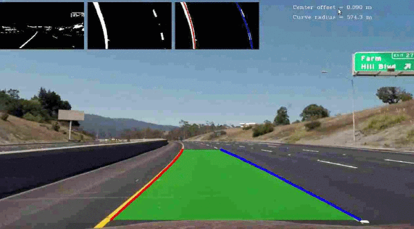

# Advanced Lane Finding

This project is just a self-learning experience by implementing in C++14 an 
algorithm similar to this 
[Udacity project](https://github.com/ndrplz/self-driving-car/tree/master/project_4_advanced_lane_finding).

Demo on straight road [videoclip](https://www.youtube.com/watch?v=4fW9n5syoqE):

## Basic Build Instructions

Prerequisites of OpenCV C++ and Boost. 
1. Install OpenCV: `sudo apt update && sudo apt install libopencv-dev python3-opencv`
2. Install Boost: `sudo apt-get install libboost-all-dev`

Then,
1. Clone this repo.
2. Make a build directory: `mkdir build && cd build`
3. Compile: `cmake .. && make`
4. Run it: `./lane_finding_advanced_cpp`

## Explanation

The implementation can be seen in `src/main.cpp` with the following steps:

1. Undistort the camera image.

2. Binarize the image to black white where the yellow and white lines of the road are highlighted.

3. Warp the image to bird-eye view (BEV).

4. Detect lane points on bird eye view.

5. Fit the lane points with second order polynomials.

6. If we are on video mode, apply simple moving-average on the polynomial coefficients.

7. Generate lane points on the BEV using the coefficients.

8. Unwarp those points back to the original undistorted image.

9. Calculate the curve radius and offset of the vehicle from the lane center

9. Visualize the result.